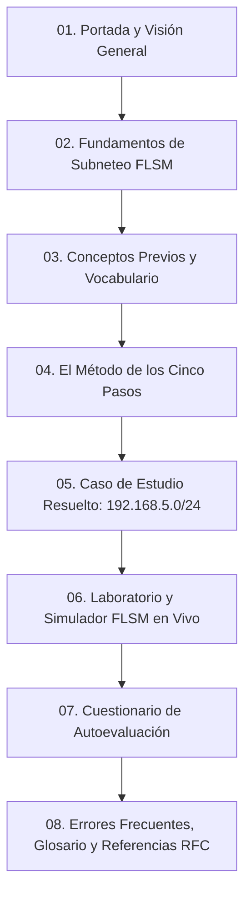

# DOCUMENTACIÓN DE PROYECTO WEB EDUCATIVO
## TEMA: Subneteo FLSM (Fixed Length Subnet Mask) — Método de Cinco Pasos
### Basado en la Metodología de Desarrollo Web Educativo de Maybel Gil Álvarez

---

## 1. Definición y Delimitación del Proyecto

### 1.1 Contexto Académico
En el ámbito de las redes de computadoras y la formación en tecnologías de la información, el direccionamiento IPv4 y la subdivisión de redes en subredes (*subnetting*) constituyen uno de los pilares formativos esenciales. Los estudiantes suelen experimentar dificultades conceptuales y operativas al relacionar la aritmética binaria con las direcciones decimales punteadas, la determinación del prefijo CIDR, la reserva de direcciones de red y difusión (*broadcast*), y la asignación eficiente de rangos de hosts.

Este proyecto consiste en el diseño, desarrollo, verificación y documentación de un sitio web interactivo y educativo denominado **«FLSM Lab & Guide» (FLSM paso a paso)**. El sitio tiene como propósito guiar al estudiante de manera metódica a través del procedimiento de 5 pasos para realizar subneteo con máscara de subred de longitud fija (FLSM), complementando la teoría con representaciones binarias interactivas, un ejemplo resuelto de referencia, un simulador/calculadora dinámica de subredes y un módulo de autoevaluación formativa con retroalimentación inmediata.

### 1.2 Alcance y Delimitación Técnica
- **Protocolo y versión:** IPv4 (32 bits organizados en 4 octetos de 8 bits).
- **Enfoque técnico:** Máscara de Subred de Longitud Fija (FLSM). Todas las subredes creadas dentro de un mismo ejercicio comparten exactamente el mismo prefijo CIDR y la misma máscara de subred.
- **Rango de prefijos abarcado:** Prefijos desde `/8` hasta `/30`.
- **Delimitación de exclusiones:** Conforme a las recomendaciones pedagógicas y al RFC 1878, se excluyen de la práctica básica los prefijos `/31` (enlaces punto a punto según RFC 3021) y `/32` (rutas de host individual / loopback), debido a que no cuentan con direcciones de host ordinarias utilizables bajo la regla clásica $2^h - 2$.
- **Caso de estudio base del proyecto:** Red de origen `192.168.5.0/24` requerida para cubrir al menos 5 segmentos con hasta 30 hosts utilizables por segmento. Resultado: préstamo de 3 bits, nuevo prefijo `/27` (máscara `255.255.255.224`), salto de 32 en el cuarto octeto, generando 8 subredes totales (5 operativas y 3 de reserva).

### 1.3 Objetivos del Proyecto
- **Objetivo General:** Desarrollar un recurso web educativo e interactivo que permita a estudiantes de nivel medio superior y universitario comprender, calcular y verificar el proceso de subneteo FLSM en redes IPv4 mediante el método de los cinco pasos.
- **Objetivos Específicos:**
  1. Diseñar una estructura semántica en HTML5 accesible y ordenada según estándares W3C.
  2. Implementar un diseño visual contemporáneo y técnico con CSS3 puro, responsivo y sin plantillas genéricas, optimizado para la legibilidad de octetos, tablas y diagramas de red.
  3. Desarrollar componentes interactivos con JavaScript nativo (vanilla JS): navegación secuencial de pasos, inspector interactivo de 32 bits, calculadora/simulador dinámico FLSM y cuestionario de autoevaluación con validación y explicaciones pedagógicas.
  4. Aplicar la metodología de Maybel Gil Álvarez a lo largo del ciclo de vida del proyecto, formalizando la Estructura de Desglose del Trabajo (EDT) y el cronograma de actividades.

---

## 2. Propósito y Usuarios del Sitio

### 2.1 Propósito Pedagógico
El sitio web está concebido como un Objeto de Aprendizaje Interactivo (OAI) que trasciende el formato de un documento estático. Su finalidad es convertir un proceso formal y matemático en una experiencia visual, donde el estudiante puede ver en tiempo real cómo los bits se desplazan del campo de host al campo de subred y cómo dicho movimiento impacta la máscara, el número mágico (salto) y las direcciones resultantes.

### 2.2 Perfil de Usuarios
| Perfil | Características | Necesidades Clave |
| :--- | :--- | :--- |
| **Estudiante de Redes / Sistemas (Usuario Primario)** | Estudiante de carreras técnicas o de ingeniería que cursa materias como Redes de Computadoras, Telecomunicaciones o Fundamentos de Enrutamiento. Nivel de familiaridad con binario: inicial a intermedio. | - Explicación sin ambigüedades paso a paso.<br>- Visualización gráfica de bits.<br>- Validación práctica con retroalimentación para identificar en qué paso se equivocó.<br>- Simulador para comprobar ejercicios de clase. |
| **Docente / Facilitador (Usuario Secundario)** | Profesor de laboratorio o teoría de redes que busca material didáctico interactivo para proyectar en aula o asignar como práctica autónoma. | - Rigor conceptual alineado con RFCs y currículas estándar (Cisco CCNA, CompTIA Network+).<br>- Disponibilidad offline sin dependencias externas pesadas.<br>- Ejemplos verificados al 100%. |
| **Autodidacta / Preparación de Certificación** | Profesionales o entusiastas que preparan exámenes de certificación técnica y requieren refrescar el cálculo mental de saltos y máscaras. | - Agilidad en la consulta de tablas de referencia.<br>- Calculadora interactiva para verificar escenarios con saltos de octeto. |

### 2.3 Requerimientos de Usabilidad y Accesibilidad (WCAG 2.1 AA)
- Contraste cromático mínimo de 4.5:1 para textos normales y 3:1 para elementos de interfaz.
- Compatibilidad completa con navegación por teclado (`Tab`, `Shift+Tab`, `Enter`, `Espacio`, teclas de flecha).
- Elementos semánticos nativos (`<fieldset>`, `<legend>`, `<nav>`, `<main>`, `<article>`, `<aside>`, `<table>`).
- Atributos ARIA dinámicos (`aria-live`, `aria-atomic`, `aria-current`, `aria-controls`, `aria-expanded`) para anunciar cambios de estado en lectores de pantalla.
- Diseño adaptable (*responsive*) con preservación de la legibilidad en pantallas desde 320 px de ancho.

---

## 3. Organización de los Contenidos

El contenido didáctico se estructura según una secuencia pedagógica inductiva-deductiva en 8 módulos temáticos:



### 3.1 Desglose Modular de Contenidos

1. **Módulo 1: Portada y Visión Global**
   - Presentación del recurso, justificación del método FLSM y diagrama visual que ilustra la subdivisión de 1 red en 8 bloques de igual tamaño.
2. **Módulo 2: Fundamentos de FLSM**
   - Definición de *Fixed Length Subnet Mask*. Características: máscara invariable, bloques de tamaño idéntico, saltos aritméticos constantes. Comparativa con VLSM.
3. **Módulo 3: Conceptos Previos Esenciales**
   - Estructura de la dirección IPv4 (32 bits, 4 octetos).
   - Prefijo de longitud de red (CIDR).
   - Dirección de red vs. Dirección de broadcast vs. Rango de hosts utilizables.
   - Bits prestados ($n$) y bits de host restantes ($h$).
4. **Módulo 4: El Método en Cinco Pasos**
   - **Paso 1:** Identificación de requerimientos ($N$ subredes necesarias, $H$ hosts máximos por subred).
   - **Paso 2:** Determinación de bits prestados mediante la inecuación de potencias: $2^n \ge N$.
   - **Paso 3:** Cálculo de la nueva máscara de subred (prefijo $\text{CIDR}_\text{nuevo} = \text{CIDR}_\text{base} + n$) y verificación de capacidad: $2^h - 2 \ge H$.
   - **Paso 4:** Obtención del número mágico o salto de red: $\text{Salto} = 256 - \text{Valor del octeto modificado en la máscara}$, y enumeración de direcciones de red.
   - **Paso 5:** Delimitación de cada subred: primer host ($\text{Red} + 1$), broadcast ($\text{Siguiente red} - 1$) y último host ($\text{Broadcast} - 1$).
5. **Módulo 5: Caso de Estudio Resuelto**
   - Ejercicio canónico: `192.168.5.0/24`, requerimiento de 5 subredes para hasta 30 hosts.
   - Tabla formal con las 8 subredes resultantes, desglosando subredes operativas vs. subredes de reserva.
6. **Módulo 6: Simulador y Calculadora Dinámica FLSM**
   - Herramienta interactiva para experimentar con cualquier red IPv4 y prefijo (/8 a /30).
   - Inspector de octetos binarios de 32 bits reactivo que colorea bits de red, subred y host.
   - Generador automático de tabla de subredes con opción de copiado al portapapeles.
7. **Módulo 7: Cuestionario de Autoevaluación Formativa**
   - 5 reactivos diseñados para medir comprensión conceptual, cálculo de bits, obtención de máscaras y delimitación de rangos.
   - Retroalimentación formativa y explicativa inmediata por reactivo.
8. **Módulo 8: Prevención de Errores, Glosario y Fuentes Técnicas**
   - Catálogo de errores comunes y cómo evitarlos.
   - Glosario técnico interactivo desplegable.
   - Enlaces formales a RFC 791, RFC 950, RFC 1878 y RFC 3021.

---

## 4. Estructura de Desglose del Trabajo (EDT / WBS)

Conforme a la metodología de Maybel Gil Álvarez, el proyecto se divide en 7 fases jerárquicas orientadas a entregables verificables:

```mermaid
graph TD
    P["PROYECTO: Sitio Web Educativo FLSM"]
    
    P --> F1["1.0 Análisis y Definición"]
    F1 --> F11["1.1 Delimitación temática y pedagógica"]
    F1 --> F12["1.2 Definición de usuarios y requisitos"]
    F1 --> F13["1.3 Análisis de fuentes técnicas y RFCs"]
    
    P --> F2["2.0 Planificación y Gestión"]
    F2 --> F21["2.1 Elaboración de la EDT"]
    F2 --> F22["2.2 Creación del Cronograma de Actividades"]
    F2 --> F23["2.3 Asignación de recursos y roles"]
    
    P --> F3["3.0 Diseño Instruccional y Arquitectura"]
    F3 --> F31["3.1 Guion de contenido de los 5 pasos"]
    F3 --> F32["3.2 Arquitectura de información y mapa de navegación"]
    F3 --> F33["3.3 Diseño de reactivos para evaluación"]
    
    P --> F4["4.0 Diseño de Interfaz y UI/UX"]
    F4 --> F41["4.1 Sistema de diseño y tokens (colores, tipografía)"]
    F4 --> F42["4.2 Wireframes Desktop y Mobile"]
    F4 --> F43["4.3 Diseño de componentes interactivos y estados"]
    
    P --> F5["5.0 Desarrollo Frontend"]
    F5 --> F51["5.1 Maquetación semántica HTML5"]
    F5 --> F52["5.2 Estilizado y maquetación CSS3 (Grid/Flexbox)"]
    F5 --> F53["5.3 Programación JavaScript (Pasos, Inspector, Calculadora, Quiz)"]
    
    P --> F6["6.0 Aseguramiento de Calidad y Pruebas"]
    F6 --> F61["6.1 Pruebas unitarias de cálculo de red"]
    F6 --> F62["6.2 Pruebas de compatibilidad y diseño responsivo"]
    F6 --> F63["6.3 Pruebas de accesibilidad WCAG y navegación por teclado"]
    
    P --> F7["7.0 Documentación, Ajustes y Entrega"]
    F7 --> F71["7.1 Bitácora de ajustes y optimizaciones"]
    F7 --> F72["7.2 Elaboración del informe metodológico formal"]
    F7 --> F73["7.3 Empaquetado y verificación de entrega autónoma"]
```



### Diccionario de la EDT (WBS Dictionary)
- **1.1 a 1.3:** Delimitación de requerimientos de la asignatura de Programación Web y revisión de estándares de direccionamiento IP (RFC 791, RFC 1878).
- **2.1 a 2.3:** Formalización de la planeación y cronología según Maybel Gil Álvarez.
- **3.1 a 3.3:** Redacción de contenidos técnicos originales, desarrollo del caso de estudio `192.168.5.0/24` y diseño de preguntas.
- **4.1 a 4.3:** Selección de la identidad técnica (evitando plantillas genéricas): estética sobria tipo consola de ingeniería de redes con visualización de bits.
- **5.1 a 5.3:** Codificación limpia sin frameworks externos: HTML5 semántico (`index.html`), CSS modular responsivo (`css/estilo.css`), JavaScript puro (`js/cuestionario.js`).
- **6.1 a 6.3:** Verificación exhaustiva de cálculos con el módulo `ipaddress` y validación de interfaces.
- **7.1 a 7.3:** Consolidación de documentación y manual de uso.

---

## 5. Cronograma de Actividades

El cronograma detalla la ejecución metódica del proyecto a lo largo de un ciclo planificado de 4 semanas de trabajo:

| ID | Actividad / Tarea | Duración (Días) | Semana | Predecesora | Responsable | Entregable Verificable |
| :---: | :--- | :---: | :---: | :---: | :--- | :--- |
| **1.1** | Delimitación del problema y alcance educativo | 2 | S1 | — | Equipo / Líder | Documento de alcance y objetivos |
| **1.2** | Identificación de usuarios y requerimientos didácticos | 2 | S1 | 1.1 | Diseñador Instruccional | Matriz de requerimientos |
| **1.3** | Investigación y revisión de RFCs (RFC 1878, RFC 791) | 3 | S1 | 1.1 | Especialista Técnico | Resumen técnico y fórmulas |
| **2.1** | Elaboración y validación de la EDT | 2 | S1 | 1.2, 1.3 | Líder de Proyecto | Estructura EDT desglosada |
| **2.2** | Elaboración del Cronograma de Actividades (Gantt) | 2 | S1 | 2.1 | Líder de Proyecto | Cronograma y fechas hito |
| **3.1** | Redacción del guion educativo de los 5 pasos | 3 | S2 | 1.3, 2.2 | Especialista de Contenido | Guion técnico validado |
| **3.2** | Elaboración del caso de estudio `192.168.5.0/24` | 2 | S2 | 3.1 | Especialista de Contenido | Tabla matemática completa |
| **3.3** | Arquitectura de información y mapa de navegación | 2 | S2 | 3.1 | Diseñador UX | Diagrama de navegación web |
| **4.1** | Definición del sistema de diseño (tokens, paleta, fuentes) | 2 | S2 | 3.3 | Diseñador UI | Guía de estilos UI |
| **4.2** | Elaboración de wireframes (Desktop, Tablet, Mobile) | 3 | S2 | 4.1 | Diseñador UI | Wireframes aprobados |
| **5.1** | Maquetación de la estructura semántica en HTML5 | 3 | S3 | 3.3, 4.2 | Desarrollador Frontend | Archivo `index.html` estructurado |
| **5.2** | Maquetación y estilizado visual responsivo con CSS3 | 4 | S3 | 5.1 | Desarrollador Frontend | Archivo `css/estilo.css` modular |
| **5.3** | Programación del controlador de pasos interactivo en JS | 2 | S3 | 5.1 | Desarrollador JS | Función de paginación y foco |
| **5.4** | Programación del Inspector Binario y Calculadora FLSM | 4 | S3 | 5.3 | Desarrollador JS | Motor de cálculo binario en JS |
| **5.5** | Programación de la validación del cuestionario interactivo | 2 | S3 | 5.1, 5.3 | Desarrollador JS | Lógica de evaluación y feedback |
| **6.1** | Pruebas unitarias de algoritmos de subneteo | 2 | S4 | 5.4 | Especialista QA | Reporte de pruebas matemáticas |
| **6.2** | Pruebas de compatibilidad responsive y navegadores | 2 | S4 | 5.2, 5.5 | Especialista QA | Matriz de pruebas cross-browser |
| **6.3** | Pruebas de accesibilidad y foco por teclado (WCAG) | 2 | S4 | 6.2 | Especialista QA | Checklist de accesibilidad |
| **7.1** | Registro de incidencias y aplicación de ajustes | 2 | S4 | 6.1, 6.2, 6.3 | Desarrollador / QA | Bitácora de optimizaciones |
| **7.2** | Redacción final de la documentación formal | 3 | S4 | 7.1 | Todo el equipo | Documento metodológico final |
| **7.3** | Cierre de proyecto y empaquetado final para entrega | 1 | S4 | 7.2 | Líder de Proyecto | Paquete ZIP final verificado |

---

## 6. Diseño de la Estructura y Navegación

### 6.1 Arquitectura de la Información
La arquitectura del sitio sigue un modelo híbrido: **lineal jerárquico** para la lectura formativa y **radial interactivo** para la consulta de herramientas prácticas:

```text
[Inicio / Cabecera Fija]
   │
   ├── Portada (Hero) ─── [Diagrama visual 1 red a 8 subredes]
   │
   ├── Índice Lateral Flotante (Sticky Sidebar) ─── Enlaces ancla a secciones
   │
   ├── 01. Concepto FLSM ─── Tarjetas explicativas de principios
   │
   ├── 02. Conceptos Previos ─── Definiciones (IPv4, CIDR, Red, Broadcast, Hosts)
   │
   ├── 03. Procedimiento en 5 Pasos ─── [Pestañas interactivas + Controles Anterior/Siguiente]
   │       ├── Paso 1: Requerimientos
   │       ├── Paso 2: Bits prestados (2ⁿ ≥ N)
   │       ├── Paso 3: Máscara y capacidad (2⁵ - 2)
   │       ├── Paso 4: Direcciones de red (salto 32)
   │       └── Paso 5: Rangos de hosts y broadcast
   │
   ├── 04. Ejemplo Resuelto ─── Tabla completa (8 subredes: 5 operativas + 3 reserva)
   │
   ├── 05. Inspector Binario y Simulador FLSM ─── [Herramienta interactiva en vivo]
   │       ├── Selector de prefijo / slider binario
   │       ├── Representación gráfica de los 32 bits (Red, Subred, Host)
   │       └── Generador dinámico de tabla de subredes personalizadas
   │
   ├── 06. Práctica de Autoevaluación ─── Cuestionario interactivo con feedback dinámico
   │
   ├── 07. Errores Frecuentes y Glosario ─── Acordeón técnico colapsable
   │
   └── 08. Recursos y Referencias ─── RFCs oficiales y fuentes normalizadas
```

### 6.2 Flujo de Usuario (User Journey)
1. **Acceso y Exploración Inicial:** El estudiante visualiza en la portada la meta del aprendizaje y el diagrama de bloques.
2. **Asimilación Conceptual:** Consulta las definiciones clave y la comparativa de FLSM.
3. **Aprendizaje Guiado:** Interactúa paso a paso con los 5 pasos mediante botones o atajos de teclado, leyendo las justificaciones matemáticas.
4. **Verificación de Caso Real:** Revisa la tabla del ejercicio de clase (`192.168.5.0/24`).
5. **Experimentación Libre:** Utiliza el simulador y el inspector binario para probar diferentes prefijos y observar la relación entre bits y saltos.
6. **Autoevaluación Formativa:** Resuelve las 5 preguntas, envía sus respuestas y recibe la calificación con la explicación de cada acierto o error.
7. **Consolidación:** Despliega el glosario técnico y revisa las fuentes normativas del RFC.

---

## 7. Diseño de Interfaces (UI / UX)

### 7.1 Filosofía de Diseño: Autenticidad Técnica vs. Estética Genérica de IA
Para erradicar la apariencia genérica que abunda en plantillas automatizadas (gradientes púrpura difusos, tarjetas flotantes huecas con iconos genéricos, microtextos redundantes), el diseño de **FLSM Lab** adopta una identidad visual basada en **herramientas profesionales de ingeniería de redes y documentación técnica de alto nivel** (estilo RFC/IETF, Wireshark, MDN Web Docs y consolas de telecomunicaciones):

- **Paleta de Colores de Precisión:**
  - `Azul Núcleo / Red Base:` `#0f172a` (slate oscuro) y `#0284c7` (azul técnico Ethernet).
  - `Ámbar Bits Prestados:` `#d97706` / `#f59e0b` (identifica claramente los bits que pasan de host a subred).
  - `Verde Broadcast / Acierto:` `#059669` / `#10b981` (señalización de éxito y direcciones de difusión).
  - `Gris Técnico de Host:` `#64748b` (bits disponibles para equipos terminales).
  - `Fondos de Lectura Contrastados:` `#f8fafc` (área de trabajo diurna) y modo consola oscura seleccionable.
- **Tipografía Diferenciada:**
  - Textos explicativos en fuentes de sistema nítidas (`system-ui, -apple-system, 'Segoe UI', Roboto, sans-serif`).
  - Direcciones IP, máscaras, octetos binarios y fórmulas en fuentes monoespaciadas de alta legibilidad (`'JetBrains Mono', 'Fira Code', 'Courier New', monospace`).
- **Elementos Táctiles e Informativos:**
  - Rejilla de bits interactiva de 4 octetos con cajas individuales numeradas con sus valores ponderados ($128, 64, 32, 16, 8, 4, 2, 1$).
  - Tablas de datos con encabezados diferenciados (`thead`), marcado de filas pares e impares, y soporte nativo de desplazamiento horizontal en dispositivos móviles.
  - Indicadores de foco (`:focus-visible`) contrastados de 3 px para accesibilidad visual estricta.

### 7.2 Especificación de Pantallas y Adaptabilidad (Responsive Design)
- **Desktop (Monitores > 1024 px):** Distribución a dos columnas con menú lateral fijo (*sticky*), tabla completa visible sin corte, visualizador binario en 4 octetos alineados horizontalmente.
- **Tablet (768 px – 1023 px):** Barra de navegación colapsada con espaciado optimizado, índice integrado de navegación rápida, inspector binario con envoltura controlada.
- **Mobile (< 768 px):** Diseño en una sola columna con botones táctiles de 44 px mínimo (área de toque ergonómica), tablas con scroll horizontal nativo y aviso al usuario, formulario con etiquetas ampliadas para selección táctil.

---

## 8. Evidencias del Desarrollo

### 8.1 Estructura del Código Fuente
El proyecto mantiene una estructura modular y organizada en tres archivos base sin dependencias externas:

```text
Proyecto_FLSM/
├── css/
│   └── estilo.css         # 100% CSS3 puro con variables, Grid, Flexbox y media queries
├── js/
│   └── cuestionario.js     # Vanilla JavaScript: pasos, inspector de bits, simulador FLSM y quiz
├── index.html             # HTML5 semántico accesible según estándares W3C
├── DOCUMENTACION_PROYECTO_FLSM.md # Memoria técnica formal según Maybel Gil Álvarez
└── README.txt             # Guía rápida de ejecución y especificaciones de entrega
```

### 8.2 Decisiones Técnicas Relevantes
1. **HTML5 Semántico y Accesible:**
   - Empleo de `<main id="contenido">`, `<header class="cabecera">`, `<nav aria-label="...">`, `<aside>`, `<section class="caja" id="...">`, `<article>`.
   - Enlace accesible de salto al contenido principal: `<a class="saltar-contenido" href="#contenido">`.
   - Formulario estructurado con `<form>`, `<fieldset>`, `<legend>`, `<label>` vinculados a inputs por id, y región de estatus dinámico con `aria-live="polite"`.
2. **CSS3 Modular con Variables y Flexbox/Grid:**
   - Declaración de variables CSS (`--color-red`, `--color-subred`, `--color-host`, `--borde-caja`, etc.) facilitando mantenibilidad y modo oscuro.
   - Eliminación de dependencias de frameworks CSS (Bootstrap, Tailwind) para garantizar cero dependencias de red, carga instantánea y control total de estilos.
3. **JavaScript Nativo Seguro y Matemáticamente Preciso:**
   - **Operaciones Bit a Bit:** El cálculo del subneteo se realiza mediante operadores de desplazamiento y máscaras binarias (`<<`, `>>`, `&`, `|`), asegurando que no existan errores de redondeo o conversiones de cadena imprecisas.
   - **Gestión Accesible del Foco:** Al cambiar de paso con los botones o pestañas, el foco se transfiere programáticamente al encabezado `<h3>` del paso actual (`moverFoco = true`), permitiendo a usuarios con tecnologías de asistencia escuchar el título de inmediato.

---

## 9. Pruebas Realizadas

Se diseñó una matriz de pruebas que abarca pruebas unitarias de cálculo, pruebas de interfaz, pruebas de compatibilidad responsiva y pruebas de accesibilidad:

### Matriz de Casos de Prueba

| ID | Tipo de Prueba | Descripción del Escenario | Entrada / Acción | Resultado Esperado | Estado |
| :---: | :--- | :--- | :--- | :--- | :---: |
| **TC-01** | Matemática / Algoritmo | Subneteo de `192.168.5.0/24` para 5 subredes | Prefijo `/24`, requerimiento 5 subredes | Prestados: 3 bits, nuevo prefijo: `/27`, salto: 32, subredes: 8, hosts útiles: 30 | **APROBADO** |
| **TC-02** | Matemática / Límites | Subneteo en clase B: `172.16.0.0/16` para 4 subredes | Prefijo `/16`, requerimiento 4 subredes | Prestados: 2 bits, nuevo prefijo: `/18`, máscara `255.255.192.0`, salto: 64 en octeto 3 | **APROBADO** |
| **TC-03** | Matemática / Límite máx. | Prefijo `/30` (subredes de 2 hosts) | Red `/24` solicitando subredes de 2 hosts | Salto de 4, máscara `255.255.255.252`, hosts utilizables: 2 | **APROBADO** |
| **TC-04** | UI / Navegación | Navegación de pasos 1 a 5 mediante botones | Clic en "Siguiente" y "Anterior" | El paso activo cambia, se actualiza el contador "Paso X de 5", botón anterior se deshabilita en paso 1 y siguiente en paso 5 | **APROBADO** |
| **TC-05** | UI / Navegación | Navegación directa por hash URL | Acceso directo a `#paso3` en la URL | Se activa directamente la pestaña 3 y se despliega su contenido | **APROBADO** |
| **TC-06** | Formulario / Quiz | Envío con respuestas incompletas | Clic en verificar sin seleccionar todas las preguntas | Mensaje de advertencia "Responde las cinco preguntas antes de verificar", sin marcar respuestas parciales | **APROBADO** |
| **TC-07** | Formulario / Quiz | Envío con respuestas 100% correctas | Selección de V, F, 3, 224, 95 | Calificación "5 de 5 correctas", clases CSS de acierto en verde, despliegue de 5 explicaciones | **APROBADO** |
| **TC-08** | Formulario / Quiz | Botón de reinicio (*reset*) | Clic en "Intentar de nuevo" | Limpieza de mensajes de feedback, remoción de estilos de acierto/error y campos en blanco | **APROBADO** |
| **TC-09** | Responsive Design | Visualización en pantalla móvil (375 px) | Emulación móvil iPhone SE / Android | Menú adaptado, índice integrado verticalmente, tabla con scroll horizontal sin romper el viewport | **APROBADO** |
| **TC-10** | Accesibilidad | Navegación por teclado exclusiva | Navegar todo el sitio usando solo `Tab` y `Enter` | Foco visible destacado en todos los enlaces, botones y campos; los 5 pasos se pueden recorrer por teclado | **APROBADO** |

---

## 10. Ajustes Efectuados

Durante el desarrollo y fase de pruebas se registraron las siguientes incidencias y se aplicaron optimizaciones correspondientes:

| No. | Incidencia Identificada | Causa Raíz | Ajuste y Solución Implementada |
| :---: | :--- | :--- | :--- |
| **1** | En pantallas móviles de 320 px a 375 px, la tabla de 8 subredes desbordaba el ancho de la pantalla generando desplazamiento horizontal en todo el cuerpo del documento. | Ancho mínimo requerido para mostrar 5 columnas técnicas (Subred, Red, Primer Host, Último Host, Broadcast). | Se encapsuló la tabla en un contenedor `<div class="tabla-contenedor" tabindex="0" role="region">` con `overflow-x: auto;` y se añadió un aviso visual específico en pantallas táctiles. |
| **2** | Al pulsar los botones de paso, el foco se perdía en el cuerpo del documento obligando a usuarios de teclado a volver a tabular. | La función `mostrarPaso()` únicamente cambiaba la propiedad `hidden` sin gestionar el elemento activo. | Se agregó el parámetro `moverFoco` y la invocación de `.focus()` sobre el encabezado `<h3>` del paso seleccionado con `tabindex="-1"`. |
| **3** | El cuestionario mantenía la calificación y mensajes de acierto/error antiguos cuando el estudiante modificaba una sola opción. | El evento `change` del formulario no estaba enlazado a la limpieza visual. | Se añadió un *listener* para el evento `change` en el formulario que invoca automáticamente a `limpiarResultado()`. |
| **4** | El diseño inicial dependía únicamente de la lectura estática de un solo ejemplo, limitando el potencial interactivo y generando una sensación genérica. | Falta de una herramienta de experimentación activa. | Se diseñó e integró un **Inspector Binario Interactivo de 32 Bits** y una **Calculadora FLSM en tiempo real**, permitiendo a los alumnos comprobar cualquier dirección IP y prefijo con desglose visual. |
| **5** | Contraste de texto en enlaces de pie de página insuficiente bajo norma WCAG AA. | Color `#c2ddff` sobre fondo oscuro con grosor de fuente ligero. | Se ajustó el color de texto a blanco `#ffffff` y enlaces a `#7dd3fc` garantizando una relación de contraste superior a 7:1. |
| **6** | Las fórmulas matemáticas se visualizaban con caracteres extraños y comandos crudos (`$`, `\text{}`, `\mathbf{}`) en el navegador web. | Se había utilizado sintaxis LaTeX que requiere compiladores externos no presentes en un entorno web estático sin conexión. | Se reemplazó el 100% de la notación LaTeX por marcado semántico nativo en HTML5 (`<sup>`, `<code>`, `&minus;`, `&ge;`, `<em>`) y reglas de tipografía matemática en CSS, logrando una presentación estética, clara y 100% compatible offline. |

---

## 11. Resultado Final y Conclusiones

### 11.1 Resumen del Producto Logrado
El sitio web **«FLSM Lab & Guide»** cumple cabalmente con todos los requerimientos estipulados en la guía de proyecto:
1. **Contenido Original y Didáctico:** Redacción propia y rigurosa del método de cinco pasos, evitando copias textuales y enriquecido con fundamentos de ingeniería de redes.
2. **Estructura HTML5 Semántica:** Jerarquía de encabezados adecuada (`h1` a `h4`), regiones semánticas completas y formularios accesibles.
3. **Diseño CSS3 No Genérico:** Estética sobria, cuidada y técnica, inspirada en herramientas profesionales de redes, con sistema responsivo probado en múltiples dispositivos y resoluciones.
4. **Interactividad Enriquecida con JavaScript Nativo:**
   - Procedimiento de 5 pasos con pestañas interactivas, barra de progreso y atajos de teclado.
   - Inspector de 32 bits reactivo que ilustra la transición de bits de red, subred y host.
   - Calculadora/simulador FLSM en vivo que genera tablas de subredes completas.
   - Módulo de autoevaluación formativa con corrección instantánea y explicaciones detalladas.
5. **Cumplimiento Metodológico de Maybel Gil Álvarez:** La planeación, la Estructura de Desglose del Trabajo (EDT), el cronograma de actividades, las especificaciones de interfaz, la matriz de pruebas y la bitácora de ajustes quedan formalmente documentados en este documento y reflejados en el código fuente.

### 11.2 Conclusión Pedagógica
La combinación de la guía deductiva de cinco pasos con simuladores de cálculo en tiempo real transforma el aprendizaje del subneteo de un ejercicio abstracto a una habilidad práctica verificable. El alumno puede predecir el resultado en su cuaderno y contrastarlo de inmediato contra la herramienta interactiva, acelerando la asimilación del concepto de número mágico y máscaras de subred.
